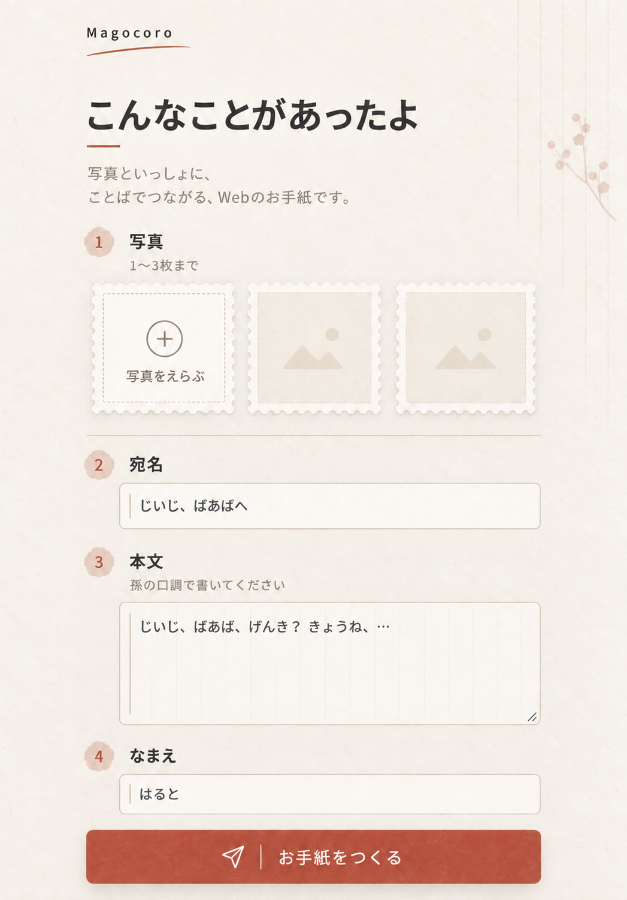

# Magocoro 作る画面 UI改修 Implementation Plan

> **For agentic workers:** REQUIRED SUB-SKILL: Use superpowers:subagent-driven-development (recommended) or superpowers:executing-plans to implement this plan task-by-task. Steps use checkbox (`- [ ]`) syntax for tracking.

**Goal:** 「作る」画面を、写真とことばで祖父母へ成長を届ける体験がひと目で伝わり、触れるとやさしく応える静かな和便箋UIへ改修する。

**Architecture:** `ComposePage` の保存処理・入力状態・`LetterApi` 境界は変えず、表示構造と `src/index.css` のスタイルを更新する。写真は常に最大3枠が理解できる構成にし、各入力を1〜4の手順として見せる。動きはCSS中心の短いマイクロインタラクションに限定し、既存の `submitting` 状態だけを保存中表示へ利用する。日付を持たない作成画面には消印を表示せず、`createdAt` を持つ手紙画面の実日付入り消印は維持する。

**Tech Stack:** React 19 + TypeScript + Tailwind CSS v4 + Vitest + Testing Library。

**Spec:** `docs/superpowers/specs/2026-09-08-magocoro-web-letter-design.md` — 実行者はSpecと本計画の両方を読むこと。

## Global Constraints

- 日本語のみ。文書言語 `lang="ja"`。
- 地 `#f7f2e9`、面 `#fffdf8`、本文 `#33302a`、補助 `#8a7f72`、罫線 `#ddd2c2`、強調（朱） `#c4543a`。切手風フレームは白縁＋波線。
- 紫・ネオン・金グラデ・飾り絵文字は禁止。本文中の絵文字は親が書いた場合のみ素通し。
- 見出しと本文は Noto Sans JP。動き150–400ms。`prefers-reduced-motion` で無効化。
- 初回表示、写真追加、focus、hover、押下、エラー表示だけを動かす。常時動く装飾、バウンド、パララックス、過度な拡大縮小は使わない。
- アニメーションライブラリやアイコンライブラリを追加せず、CSSと既存のReact状態だけで実装する。
- タップ面44px以上。ページ全体の横スクロール禁止。最大幅モバイルカラム（`max-w-lg`）中央寄せ。
- 写真は JPEG / PNG / WebP、1〜3枚、1枚10MBまで。
- 保存処理、入力検証、写真の削除・並べ替え、エラー時の入力保持、成功後の遷移は変更しない。
- 新しい外部依存、外部LLM、決済、LINE連携は追加しない。
- 画像モック内の生成写真や図形は方向性の参考であり、実装へ固定素材として組み込まない。実画面では利用者が選んだ写真だけを表示する。

---

## Approved UI Reference



実装時の優先順位は、正本Spec、本計画の明記内容、上の画像の順とする。画像から採用する要素は、静かな和便箋の質感、1〜4の手順表示、3つの写真枠、細い罫線、朱色の主ボタン、ゆとりのある文字階層である。

画像右上に以前あった空の消印は採用しない。作成画面には日付データがないため、ヘッダー右上は余白として扱う。`LetterPage` の `createdAt` を表示する `.postmark` は削除しない。

## File Structure

```text
docs/superpowers/assets/
  2026-09-10-magocoro-compose-ui-reference.png  # 承認済みUIイメージ
docs/superpowers/plans/
  2026-09-10-magocoro-compose-ui-refresh.md     # 本計画
src/
  compose/ComposePage.tsx                       # 手順構造、写真3枠、表示文言、保存中状態
  index.css                                     # 和便箋のレイアウトとマイクロインタラクション
tests/
  compose/ComposePage.test.tsx                  # 構造、消印非表示、既存挙動の回帰テスト
```

---

### Task 1: 作る画面を「4つの手順」に再構成する

**Files:**
- Modify: `tests/compose/ComposePage.test.tsx`
- Modify: `src/compose/ComposePage.tsx`
- Modify: `src/index.css`

**Interfaces:**
- Consumes: 既存の `ComposePage({ api }: { api: LetterApi })`、`onPhotos`、`reorderPhotos`、`removePhoto`、`onSubmit`。
- Produces: 同じ `ComposePage` 公開APIと保存フローを保ったまま、`.compose-intro`、4個の `.step-index`、3枠の `.photo-slot-grid` を持ち、空の `.compose-seal` を持たない画面。
- Preserves: `LetterApi.createLetter({ photos, addressTo, body, signature })` の引数、`/letter/:id` への遷移、入力の制約とエラーメッセージ。

- [ ] **Step 1: UI構造の失敗テストを書く**

`tests/compose/ComposePage.test.tsx` の先頭テストを次の内容へ置き換える。

```tsx
it("frames composing as four stationery steps without an empty postmark", () => {
  const api: LetterApi = {
    createLetter: vi.fn(),
    getLetter: vi.fn(),
    addStamp: vi.fn(),
  };
  const { container } = renderCompose(api);

  expect(
    screen.getByRole("heading", { name: "こんなことがあったよ" }),
  ).toBeInTheDocument();
  expect(screen.getByText("写真といっしょに、ことばでつながる、Webのお手紙です。"))
    .toBeInTheDocument();
  expect(screen.getByRole("banner", { name: "便箋のヘッダー" })).toBeInTheDocument();
  expect(screen.getByRole("group", { name: "写真を飾る" })).toBeInTheDocument();
  expect(screen.getByText("写真は1〜3枚まで。1枚10MBまで")).toBeInTheDocument();

  expect(
    Array.from(container.querySelectorAll(".step-index"), (node) => node.textContent),
  ).toEqual(["1", "2", "3", "4"]);
  expect(container.querySelectorAll(".photo-slot")).toHaveLength(3);
  expect(container.querySelector(".compose-seal")).not.toBeInTheDocument();
});
```

- [ ] **Step 2: テストが意図した理由で失敗することを確認する**

Run: `npx vitest run tests/compose/ComposePage.test.tsx`

Expected: FAIL。導入文、`.step-index`、`.photo-slot` がまだなく、既存の `.compose-seal` が残っていることが原因になっている。

- [ ] **Step 3: 写真枠の表示数を算出する**

`ComposePage` の `reason` より前に、アップロード操作の1枠を含めて合計3枠になる値を追加する。

```tsx
const emptyPhotoSlotCount = Math.max(0, 2 - photos.length);
```

写真が0枚なら「追加」1枠＋空枠2個、1枚なら写真1枠＋「追加」1枠＋空枠1個、2枚なら写真2枠＋「追加」1枠、3枚なら写真3枠とする。

- [ ] **Step 4: ヘッダーと写真セクションを置き換える**

`ComposePage` の `<header className="compose-header">` と `album-section` を、次の構造へ変更する。既存の写真カード内にあるプレビュー、移動ボタン、削除ボタン、pointer/keyboardイベントはそのまま移植する。

```tsx
<header className="compose-header" aria-label="便箋のヘッダー">
  <div className="brand-lockup">
    <h1 className="wordmark">Magocoro</h1>
    <span className="brand-wave" aria-hidden="true" />
  </div>
  <h2 className="compose-title">こんなことがあったよ</h2>
  <p className="compose-intro">
    写真といっしょに、ことばでつながる、Webのお手紙です。
  </p>
</header>

<section className="album-section compose-step">
  <div className="step-heading-row">
    <span className="step-index" aria-hidden="true">1</span>
    <div className="step-heading-copy">
      <div className="section-heading-row">
        <h2 id="photos-heading" className="section-title">写真</h2>
        <span className="section-count">{photos.length}/3</span>
      </div>
      <p className="section-helper">写真は1〜3枚まで。1枚10MBまで</p>
    </div>
  </div>

  <div className="photo-slot-grid" role="group" aria-label="写真を飾る">
    {photos.map((file, i) => (
      <div
        key={`${file.name}-${i}`}
        className={[
          "photo-card",
          "photo-slot",
          draggingIndex === i ? "is-dragging" : "",
          dragOverIndex === i && draggingIndex !== i ? "is-drag-over" : "",
        ].filter(Boolean).join(" ")}
        data-photo-index={i}
      >
        
        <div className="photo-actions">
          <button
            type="button"
            className="photo-action photo-drag-handle"
            aria-label={`写真${i + 1}を並べ替え`}
            onPointerDown={(event) => onPhotoPointerDown(i, event)}
            onPointerMove={(event) => onPhotoPointerMove(i, event)}
            onPointerUp={(event) => endPhotoPointerDrag(i, event)}
            onPointerCancel={(event) => cancelPhotoPointerDrag(i, event)}
            onKeyDown={(event) => onPhotoHandleKeyDown(i, event)}
          >
            移動
          </button>
          <button
            type="button"
            className="photo-action photo-remove-button"
            aria-label={`写真${i + 1}を削除`}
            onClick={() => removePhoto(i)}
          >
            ×
          </button>
        </div>
      </div>
    ))}

    {photos.length < 3 ? (
      <label htmlFor="photos" className="photo-picker photo-slot">
        <span className="photo-picker-mark" aria-hidden="true">＋</span>
        <span className="photo-picker-title">写真をえらぶ</span>
      </label>
    ) : null}

    {Array.from({ length: emptyPhotoSlotCount }, (_, index) => (
      <span key={index} className="photo-slot photo-slot-empty" aria-hidden="true" />
    ))}
  </div>
</section>
```

`.compose-seal` 要素は削除する。ファイル入力と `photoError` は `photo-slot-grid` の直後に残す。

- [ ] **Step 5: 宛名・本文・署名を手順2〜4として表示する**

3つの `field-group` をそれぞれ `.compose-step` で囲み、次の見出し構造を入れる。`htmlFor` と入力の `id` は維持する。

```tsx
<section className="field-group compose-step">
  <div className="step-heading-row">
    <span className="step-index" aria-hidden="true">2</span>
    <label htmlFor="addressTo" className="field-label required-label">宛名</label>
  </div>
  <input
    id="addressTo"
    value={addressTo}
    onChange={(e) => setAddressTo(e.target.value)}
    className="field-input"
  />
</section>

<section className="field-group compose-step">
  <div className="step-heading-row">
    <span className="step-index" aria-hidden="true">3</span>
    <div className="step-heading-copy">
      <div className="field-heading-row">
        <label htmlFor="body" className="field-label required-label">本文</label>
        <span className="field-limit">{body.length}/1000</span>
      </div>
      <p className="field-helper">孫の口調で書いてください</p>
    </div>
  </div>
  <textarea
    id="body"
    value={body}
    onChange={(e) => setBody(e.target.value)}
    placeholder="じいじ、ばあば、げんき？ きょうね、…"
    rows={6}
    className="field-input field-textarea"
  />
</section>

<section className="field-group compose-step">
  <div className="step-heading-row">
    <span className="step-index" aria-hidden="true">4</span>
    <label htmlFor="signature" className="field-label required-label">なまえ</label>
  </div>
  <input
    id="signature"
    aria-label="署名"
    value={signature}
    onChange={(e) => setSignature(e.target.value)}
    placeholder="はると"
    className="field-input"
  />
</section>
```

テストとアクセシビリティ上の入力名は「署名」を維持し、画面上は祖父母・親に親しみやすい「なまえ」と表示する。`album-divider` と `album-footer` は削除し、視覚的な区切りは各 `.compose-step` の罫線へ集約する。

- [ ] **Step 6: 承認画像に合わせたCSSへ更新する**

`src/index.css` から `.compose-seal` 一式、旧 `.photo-mat`、旧 `.album-divider`、`.album-footer` の作る画面専用指定を削除し、次を追加する。手紙画面で共有している `.letter-photo-mat`、`.letter-photo-grid`、`.postmark` は変更しない。

```css
.compose-header {
  padding-top: 1rem;
}

.compose-title {
  margin: 2.5rem 0 0;
  font-size: clamp(2rem, 8vw, 3rem);
  font-weight: 700;
  letter-spacing: -0.045em;
  line-height: 1.3;
}

.compose-title::after {
  display: block;
  width: 2.5rem;
  margin-top: 0.75rem;
  border-top: 2px solid var(--color-accent);
  content: "";
}

.compose-intro {
  max-width: 24rem;
  margin: 1.2rem 0 0;
  color: var(--color-muted);
  font-size: 0.95rem;
  line-height: 1.8;
}

.letter-form {
  margin-top: 2rem;
}

.compose-step {
  padding: 1.5rem 0;
  border-top: 1px solid var(--color-line);
}

.compose-step:first-child {
  padding-top: 0;
  border-top: 0;
}

.field-group + .field-group {
  margin-top: 0;
}

.step-heading-row {
  display: grid;
  grid-template-columns: 2.5rem minmax(0, 1fr);
  align-items: start;
  gap: 0.75rem;
}

.step-heading-copy {
  min-width: 0;
}

.step-index {
  display: grid;
  width: 2.25rem;
  min-height: 2.25rem;
  place-items: center;
  border-radius: 50%;
  background: rgb(196 84 58 / 0.12);
  color: var(--color-accent);
  font-size: 0.9rem;
  font-weight: 700;
}

.photo-slot-grid {
  display: grid;
  grid-template-columns: repeat(3, minmax(0, 1fr));
  gap: 0.65rem;
  margin-top: 1rem;
}

.photo-slot {
  min-width: 0;
  aspect-ratio: 0.92;
  border: 0.35rem solid #fff;
  background: rgb(255 253 248 / 0.72);
  box-shadow: 0 0 0 1px var(--color-line), 0 0.35rem 0.9rem rgb(51 48 42 / 0.07);
}

.photo-picker {
  display: flex;
  min-height: 0;
  margin: 0;
  align-items: center;
  justify-content: center;
  border-style: solid;
}

.photo-picker-mark {
  display: grid;
  width: 2.75rem;
  min-height: 2.75rem;
  place-items: center;
  border: 1px solid var(--color-muted);
  border-radius: 50%;
  font-size: 1.5rem;
  line-height: 1;
}

.photo-picker-title {
  margin-top: 0.45rem;
  font-size: clamp(0.72rem, 2.8vw, 0.95rem);
}

.photo-slot-empty {
  display: block;
  opacity: 0.58;
}

.photo-preview {
  height: 100%;
  aspect-ratio: auto;
  border: 0;
  box-shadow: none;
}

.step-heading-row + .field-input {
  width: calc(100% - 3.25rem);
  margin-left: 3.25rem;
}

.primary-button {
  margin-top: 0.75rem;
  border-radius: 0.55rem;
  box-shadow: 0 0.35rem 0.8rem rgb(196 84 58 / 0.12);
}

@media (max-width: 380px) {
  .photo-slot-grid {
    gap: 0.45rem;
  }

  .photo-slot {
    border-width: 0.25rem;
  }

  .photo-picker-mark {
    width: 2.5rem;
    min-height: 2.5rem;
  }
}
```

切手の波線は `border-image` や手作りSVGで模倣せず、白縁・紙の影・既存の細線だけで表現する。モックの紙飛行機は新しいアイコン依存を増やさないため採用せず、主ボタンは「お手紙をつくる」の文字だけで成立させる。既存 `.primary-button::after` の文字矢印も削除する。

- [ ] **Step 7: 狭いテストを通す**

Run: `npx vitest run tests/compose/ComposePage.test.tsx`

Expected: PASS。新しい構造テストに加え、必須入力、保存成功、保存失敗、形式・容量検証、削除、pointer並べ替え、keyboard並べ替えの既存テストがすべて通る。

- [ ] **Step 8: 実画面を承認画像と比較する**

Run: `npm run dev`

幅 `390px` と `512px` で `/` を開き、次を目視確認する。

- ヘッダー右上に空の消印や日付用の円が表示されない。
- 1〜4の順序が上から自然に追え、写真0枚でも3枠が一列に収まる。
- 写真を1枚、2枚、3枚と追加しても枠が崩れず、削除・並べ替え操作が44px以上を保つ。
- 本文1000字、署名20字、エラー文、disabled状態でレイアウトが横へはみ出さない。
- `prefers-reduced-motion: reduce` でhover/focusの動きが実質無効になる。
- `/letter/:id` の実日付入り消印と手紙表示の見た目に回帰がない。

- [ ] **Step 9: 全体検証を通す**

Run: `npm test`

Expected: UIテストとWorkerテストがすべてPASS。

Run: `npm run lint`

Expected: oxlintエラーなし。

Run: `npm run build`

Expected: TypeScriptの型チェックとVite本番ビルドが成功。

- [ ] **Step 10: UI改修をコミットする**

```bash
git add src/compose/ComposePage.tsx src/index.css tests/compose/ComposePage.test.tsx
git commit -m "style: refine compose screen as quiet stationery"
```

このコミットには実装ファイルだけを含める。計画書と承認画像が未コミットなら、実装開始前に別のdocsコミットとして記録する。

---

### Task 2: 紙と写真に沿ったマイクロインタラクションを加える

**Files:**
- Modify: `tests/compose/ComposePage.test.tsx`
- Modify: `src/compose/ComposePage.tsx`
- Modify: `src/index.css`

**Interfaces:**
- Consumes: Task 1の `.compose-header`、`.compose-step`、`.step-index`、`.photo-card`、`.photo-picker` と、既存の `submitting: boolean`。
- Produces: 初回の段階表示、写真を置く動き、focus/hover/押下フィードバック、短いエラー表示、保存中の `aria-busy="true"` と「お手紙をつくっています…」表示。
- Preserves: `prefers-reduced-motion: reduce` では遅延を含む動きを即時化し、操作可否とAPI呼び出し回数を変えない。

- [ ] **Step 1: 保存中フィードバックの失敗テストを書く**

`tests/compose/ComposePage.test.tsx` に次のテストを追加する。

```tsx
it("shows a busy label while the letter is being created", async () => {
  const user = userEvent.setup();
  let resolveCreate!: (value: { id: string }) => void;
  const createLetter = vi.fn(
    () =>
      new Promise<{ id: string }>((resolve) => {
        resolveCreate = resolve;
      }),
  );
  const api: LetterApi = {
    createLetter,
    getLetter: vi.fn(),
    addStamp: vi.fn(),
  };
  renderCompose(api);

  await user.upload(screen.getByLabelText("写真"), jpeg());
  await user.type(screen.getByLabelText("本文"), "きょうね、たてたよ");
  await user.type(screen.getByLabelText("署名"), "はると");
  await user.click(screen.getByRole("button", { name: "お手紙をつくる" }));

  const busyButton = screen.getByRole("button", {
    name: "お手紙をつくっています…",
  });
  expect(busyButton).toBeDisabled();
  expect(busyButton).toHaveAttribute("aria-busy", "true");
  expect(createLetter).toHaveBeenCalledTimes(1);

  resolveCreate({ id: "l_aaaaaaaaaaaaaaaaaaaaaaaaaaaaaaaa" });
  expect(await screen.findByText("手紙ページ 送り側")).toBeInTheDocument();
});
```

- [ ] **Step 2: テストが意図した理由で失敗することを確認する**

Run: `npx vitest run tests/compose/ComposePage.test.tsx -t "shows a busy label"`

Expected: FAIL。ボタンが保存中も「お手紙をつくる」のままで、`aria-busy` がないことが原因になっている。

- [ ] **Step 3: 保存中のボタン文言と状態を実装する**

`ComposePage.tsx` の送信ボタンを次へ置き換える。

```tsx
<button
  type="submit"
  disabled={Boolean(reason) || submitting}
  aria-busy={submitting}
  className="primary-button"
>
  {submitting ? "お手紙をつくっています…" : "お手紙をつくる"}
</button>
```

Run: `npx vitest run tests/compose/ComposePage.test.tsx -t "shows a busy label"`

Expected: PASS。保存中はボタンがdisabledかつbusyになり、Promise解決後は従来どおり手紙画面へ進む。

- [ ] **Step 4: 4つの手順へ順序クラスを付ける**

Task 1で作成した4つのsectionのclassNameを次の値へ変更する。

```tsx
<section className="album-section compose-step step-one">
<section className="field-group compose-step step-two">
<section className="field-group compose-step step-three">
<section className="field-group compose-step step-four">
```

順序クラスは初回表示のdelayだけに利用し、手順の意味や入力値の管理には利用しない。

- [ ] **Step 5: 初回表示と写真追加の動きを実装する**

`src/index.css` に次を追加する。

```css
@keyframes compose-reveal {
  from {
    opacity: 0;
    transform: translateY(8px);
  }
  to {
    opacity: 1;
    transform: translateY(0);
  }
}

@keyframes photo-place {
  from {
    opacity: 0;
    transform: translateY(6px) scale(0.98);
  }
  to {
    opacity: 1;
    transform: translateY(0) scale(1);
  }
}

@keyframes feedback-in {
  from {
    opacity: 0;
    transform: translateY(-4px);
  }
  to {
    opacity: 1;
    transform: translateY(0);
  }
}

.compose-header {
  animation: compose-reveal 220ms ease-out both;
}

.compose-step {
  animation: compose-reveal 240ms ease-out both;
}

.step-one {
  animation-delay: 0ms;
}

.step-two {
  animation-delay: 40ms;
}

.step-three {
  animation-delay: 80ms;
}

.step-four {
  animation-delay: 120ms;
}

.photo-card {
  animation: photo-place 260ms cubic-bezier(0.2, 0.8, 0.2, 1) both;
}

.form-error,
.form-hint {
  animation: feedback-in 180ms ease-out both;
}
```

各animationの継続時間は180〜260ms、最後の手順まで含む初回表示は360ms以内に収める。初回表示はページを開いたときの1回だけで、ループさせない。

- [ ] **Step 6: focus、hover、押下のフィードバックを実装する**

`src/index.css` に次を追加する。

```css
.compose-step .step-index {
  transition: background-color 200ms ease, color 200ms ease, transform 200ms ease;
}

.compose-step:focus-within .step-index {
  background: var(--color-accent);
  color: var(--color-surface);
  transform: scale(1.04);
}

.compose-step:focus-within {
  border-top-color: rgb(196 84 58 / 0.42);
}

.photo-slot {
  transition: border-color 200ms ease, box-shadow 200ms ease, transform 200ms ease;
}

@media (hover: hover) {
  .photo-picker:hover,
  .photo-card:hover {
    border-color: rgb(196 84 58 / 0.55);
    box-shadow: 0 0 0 1px rgb(196 84 58 / 0.35),
      0 0.55rem 1.1rem rgb(51 48 42 / 0.11);
    transform: translateY(-2px);
  }
}

.photo-picker:focus-visible,
.photo-action:focus-visible {
  border-color: var(--color-accent);
}

.primary-button:active:not(:disabled) {
  transform: translateY(1px) scale(0.995);
}

.primary-button[aria-busy="true"] {
  cursor: wait;
}
```

hoverはhover可能な端末だけに適用する。ドラッグ中の `.is-dragging` と `.is-drag-over` は既存指定を優先し、写真が指から離れたように見えない範囲の2px移動に留める。

- [ ] **Step 7: reduced motionで遅延を含む動きを止める**

既存の `@media (prefers-reduced-motion: reduce)` 内を次の内容にする。

```css
@media (prefers-reduced-motion: reduce) {
  *,
  *::before,
  *::after {
    animation-delay: 0s !important;
    animation-duration: 0.01ms !important;
    animation-iteration-count: 1 !important;
    transition-delay: 0s !important;
    transition-duration: 0.01ms !important;
    scroll-behavior: auto !important;
  }
}
```

これにより、初回表示のstagger delayも残らず、情報と操作結果は即時に表示される。

- [ ] **Step 8: 動きと操作状態を目視確認する**

Run: `npm run dev`

通常設定とOSの「視差効果を減らす／動きを減らす」を有効にした設定の両方で `/` を確認する。

- 通常時は見出しと手順が一度だけ順に現れ、合計360ms以内に静止する。
- 写真追加時は対象写真だけが紙の上へ置かれるように現れる。
- keyboard focusでは対象手順の番号が朱色になり、focus ringが消えない。
- hover可能な端末だけで写真枠が最大2px持ち上がる。
- 主ボタンは押下時だけ沈み、保存中は連打できず文言が変わる。
- エラー文は180msで現れ、入力値を消さない。
- reduced motion時はstagger、移動、拡大縮小が視認できない速度で完了する。
- 常時動く装飾、バウンド、パララックスが存在しない。

- [ ] **Step 9: 全体検証を通す**

Run: `npm test`

Expected: UIテストとWorkerテストがすべてPASS。

Run: `npm run lint`

Expected: oxlintエラーなし。

Run: `npm run build`

Expected: TypeScriptの型チェックとVite本番ビルドが成功。

- [ ] **Step 10: マイクロインタラクションをコミットする**

```bash
git add src/compose/ComposePage.tsx src/index.css tests/compose/ComposePage.test.tsx
git commit -m "style: add gentle compose interactions"
```

---

## Acceptance Checklist

- 作成画面の第一印象が汎用フォームではなく「写真とことばを入れる和便箋」になっている。
- 写真・宛名・本文・なまえが1〜4の手順として迷わず追える。
- 日付を持たない作成画面には空の消印を出さない。
- 実日付を持つ手紙画面では従来どおり消印を出す。
- 写真1〜3枚、本文1〜1000字、署名1〜20字の仕様と保存APIは変わらない。
- 写真の削除、pointer/keyboard並べ替え、保存失敗時の入力保持が維持される。
- 初回表示、写真追加、focus、hover、押下、エラー表示が180〜360msの穏やかな動きで応答する。
- 保存中はボタンが「お手紙をつくっています…」となり、`aria-busy="true"` とdisabledを持つ。
- `prefers-reduced-motion` ではanimation delayを含む動きが即時化される。
- 常時動く装飾、バウンド、パララックス、過度な拡大縮小がない。
- `390px` と `512px` の両方で横スクロールがなく、主要タップ面は44px以上。
- 色、書体、動き、禁止装飾が正本Specの制約を満たす。
- `npm test`、`npm run lint`、`npm run build` がすべて成功する。
